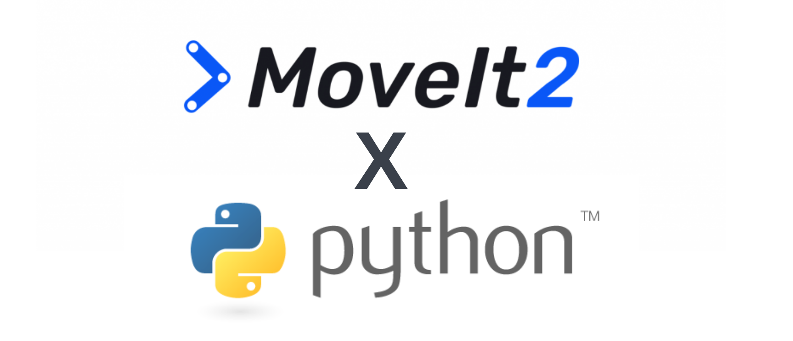

# MoveIt Python Library (beta-release)

`moveit_py` is a Python library for interfacing with the core functionalities of Moveit 2. 
The goal of this library is to provide a simplified interface for Moveit 2 Python users. 

This Python library depends on [Pybind11](https://pybind11.readthedocs.io/en/stable/index.html) for generating Python bindings.
The project is split into the following folders: 

    ├── docs                    # Sphinx documentation files
    ├── moveit_py               # Python library stubs; Python functionalities built on top of bindings
    ├── src/moveit_py           # Pybind11 binding code
    ├── test                    # Unit and integration testing
   
 

## Installation
Placeholder

## Tutorials
(1) [Using Jupyter Notebooks]()

(2) [Motion Planning]()

(3) [Teleoperation]()

## Contribution Guidelines
Community contributions are welcome. 

For detailed contribution guidelines please consult the official [Moveit contribution guidelines](https://moveit.ros.org/documentation/contributing/).

## Acknowledgements
Thank you to the [Google Summer of Code program](https://summerofcode.withgoogle.com/) for sponsoring the initial development of this Python library. 
